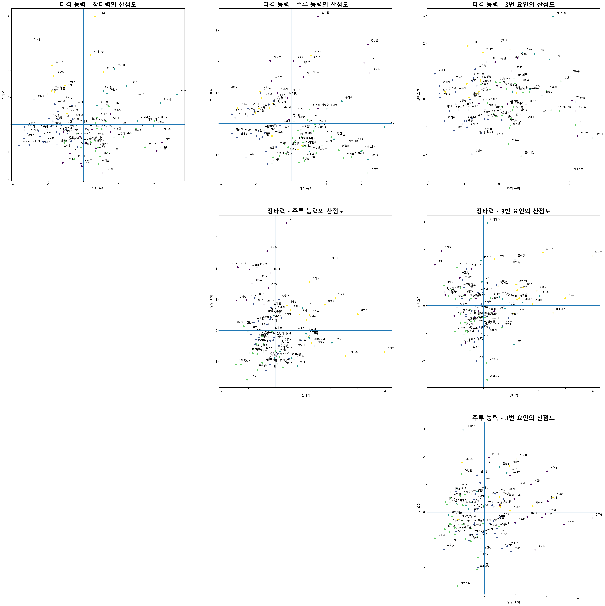

# KBO 선수 분석 보고서

# 1. 데이터 수집

---

데이터는 KBO 공식 웹사이트 ([https://www.koreabaseball.com/Player/Search.aspx](https://www.koreabaseball.com/Player/Search.aspx))에서

selenium을 사용해서 크롤링 진행했습니다.

- 야수 데이터
    
    총 303명 선수 데이터의 데이터를 수집했고 형식은 다음과 같습니다.
    
| **컬럼명**   | 데이터 타입 |
|-----------| --- |
| player_id | int |
| 타율        | float |
| 경기        | int |
| 타석        | int |
| 타수        | int |
| 득점        | int |
| 안타        | int |
| 2루타       | int |
| 3루타       | int |
| 홈런        | int |
| 루타        | int |
| 타점        | int |
| 도루        | int |
| 도루실패      | int |
| 희생번트      | int |
| 희생플라이     | int |
| 볼넷        | int |
| 고의4구      | int |
| 사구        | int |
| 삼진        | int |
| 병살타       | int |
| 장타율       | float |
| 출루율       | float |
| 실책        | int |
| 도루성공률     | float |
| 멀티히트      | int |
| 출루율+장타율   | float |
| 득점권타율     | float |
| 대타타율      | float |

- 투수 데이터
    
    총 278명 선수 데이터를 수집했고 형식은 다음과 같습니다.


| 컬럼명       | 데이터타입 |
|-----------|-------|
| player_id | int   |
| 평균자책점     | float |
| 경기        | int   |
| 완투        | int   |
| 완봉        | int   |
| 승리        | int   |
| 패배        | int   |
| 세이브       | int   |
| 홀드        | int   |
| 승률        | float |
| 타자수       | int   |
| 투구수       | int   |
| 이닝        | float |
| 피안타       | int   |
| 2루타       | int   |
| 3루타       | int   |
| 홈런        | int   |
| 희생번트      | int   |
| 희생플라이     | int   |
| 볼넷        | int   |
| 고의4구      | int   |
| 삼진        | int   |
| 폭투        | int   |
| 보크        | int   |
| 실점        | int   |
| 자책점       | int   |
| 블론세이브     | int   |
| 이닝당 출루허용률 | float |
| 피안타율      | float |
| 퀄리티스타트    | int   |


야수 데이터는 200 타석 이상의 선수 데이터를 사용해서 분석을 진행하였습니다.

다음 항목의 변수들을 사용해서 분석을 진행했습니다.

```
타율, 득점, 안타, 2루타, 3루타, 홈런, 타점, 도루,
희생번트, 희생플라이, 볼넷, 사구, 삼진, 병살타, 장타율,
출루율, 실책, 득점권타율, 대타타율
```

# 2. 주성분 분석, 요인분석 가능 여부 확인

---

주성분 분석과 요인분석이 가능한 데이터인지 여부를 확인하기 위해서 Bartlett’s Sphericity Test를  진행해주었습니다.

```python
stat, p_value = factor_analyzer.calculate_bartlett_sphericity(hitter_data_df)
print(p_value)
```

결과 : p-value가 0이 나왔습니다. 주성분분석과 요인분석이 가능합니다.

# 3. 데이터 전처리

---

변수의 단위가 다른 문제를 해결하기 위해서 표준화를 진행해주었습니다.

```python
from sklearn.preprocessing import StandardScaler
hitter_data_df_scaled = scaler.fit_transform(hitter_data_df)
```

# 4. 주성분 분석

---

```python
num_components = min(hitter_data_df.shape)
pca = PCA(num_components)
PCA_result = pca.fit_transform(hitter_data_df_scaled)
```

- 스크리 플롯
    
    
    
    주성분이 4개 이후부터 eigenvalue의 변화율이 크게 달라지기 때문에
    주성분의 개수는 4개로 사용해주었습니다.
    
- 주성분과 변수간 상관계수 히트맵
    
    ```python
    corrlation_X_Z0 = []
    for i in range(hitter_data_df_scaled.shape[1]):
        corrlation = float(np.corrcoef(PCA_result[:, 0], hitter_data_df_scaled[:, i])[0 ,1])
        corrlation_X_Z0.append(corrlation)
    
    corrlation_X_Z1 = []
    for i in range(hitter_data_df_scaled.shape[1]):
        corrlation = float(np.corrcoef(PCA_result[:, 1], hitter_data_df_scaled[:, i])[0 ,1])
        corrlation_X_Z1.append(corrlation)
    
    corrlation_X_Z2 = []
    for i in range(hitter_data_df_scaled.shape[1]):
        corrlation = float(np.corrcoef(PCA_result[:, 2], hitter_data_df_scaled[:, i])[0 ,1])
        corrlation_X_Z2.append(corrlation)
    
    corrlation_X_Z3 = []
    for i in range(hitter_data_df_scaled.shape[1]):
        corrlation = float(np.corrcoef(PCA_result[:, 3], hitter_data_df_scaled[:, i])[0 ,1])
        corrlation_X_Z3.append(corrlation)
    
    correlation_X_Z0_Z1_Z2_Z3 = pd.DataFrame({
            "Z0_correlation" : corrlation_X_Z0,
            "Z1_correlation" : corrlation_X_Z1,
            "Z2_correlation" : corrlation_X_Z2,
            "Z3_correlation" : corrlation_X_Z3,
        },
        index = hitter_data_df.columns
    )
    
    correlation_X_Z0_Z1_Z2_Z3
    ```
    
    
    

- 주성분 분석의 결과로 군집화 진행
    
    ```python
    kmenas_pwa = KMeans(n_clusters=5)
    kmenas_pwa.fit(PCA_result)
    clusters = kmenas_pwa.fit_predict(PCA_result[:, :4])
    ```
    
- 주성분과 군집화 결과를 2차원 평면에 산점도로 표시
    
    
    

# 5. 요인 분석

---

```python
num_factors = min(hitter_data_df_scaled.shape) - 1
fa = factor_analyzer.FactorAnalyzer(num_factors, rotation="varimax")
Fa_result = fa.fit(hitter_data_df_scaled)
```

- 스크리플롯
    
    
    
    주성분 분석과 마찬가지로 요인의 개수가 4개 이후로 감소하는 기울기가 크게 변하기 때문에 요인의 개수는 4개를 사용하였습니다.
    
- 적재값 히트맵 구하기
    
    
    
- 요인 해석

| 요인    | 변수와 관계                             | 해석                                                                                          |
|-------|------------------------------------|---------------------------------------------------------------------------------------------|
| 0번 요인 | 타율, 출루율, 득점권타율, 안타와 적재값이 0.6이상     | 타격 능력을 의미하는 요인이라고 생각됩니다.                                                                    |
| 1번 요인 | 홈런, 장타율, 타점, 삼진 변수와 적재값이 0.6이상     | 장타력을 의미하는 요인이라고 생각됩니다. <br>이때 삼진 개수와 1번 요인의 적재값이 높기때문에 장타력이라고 해석해야 하는지는 조금 더 생각해봐야 할것 같습니다. |
| 2번 요인 | 도루, 3루타와 적재값 0.7이상, 득점과의 적재값은 0.59 | 주루 능력을 의미하는 요인이라고 생각됩니다.                                                                    |                                                                                         |
| 3번 요인 | 병살타, 볼넷과 비교적 높은 적재값                | 뚜렷한 특징으로 정의하기 어렵습니다.                                                                        |
    
- 군집화 및 2차원 산점도로 표시
    
    